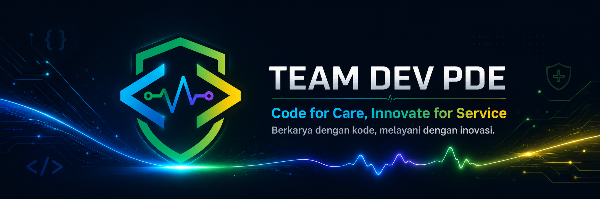

### Code for Care, Innovate for Service

**Berkarya dengan kode, melayani dengan inovasi.**

---

## Tentang TEAM DEV PDE

**TEAM DEV PDE** adalah tim pengembang teknologi informasi di lingkungan **PDE RSUD Bangil** yang berfokus pada pengembangan, integrasi, pemeliharaan, dan peningkatan sistem digital untuk mendukung pelayanan rumah sakit.

Kami membangun solusi digital yang tidak hanya berjalan secara teknis, tetapi juga berdampak langsung pada efisiensi kerja, kecepatan pelayanan, keamanan data, dan kenyamanan pengguna, baik untuk tenaga kesehatan, manajemen, maupun unit pelayanan.

---

## Filosofi Logo

Logo TEAM DEV PDE merepresentasikan peran tim sebagai penjaga stabilitas sistem, pengembang solusi digital, dan penggerak transformasi teknologi di lingkungan rumah sakit.

### Perisai

Bentuk perisai melambangkan **perlindungan, keamanan, dan kepercayaan**. Ini mencerminkan tanggung jawab PDE dalam menjaga sistem informasi, data, dan layanan digital agar tetap aman, stabil, dan dapat diandalkan.

### Simbol Kode

Elemen berbentuk tag atau bracket menggambarkan dunia **software development**, integrasi sistem, API, otomasi proses, dan rekayasa perangkat lunak.

### Heartbeat / Chart Line

Garis tengah yang menyerupai detak jantung menggambarkan dua hal utama:  
**pelayanan kesehatan yang terus hidup** dan **sistem digital yang terus dipantau, dikembangkan, serta dijaga performanya**.

### Warna

- **Hijau** melambangkan kesehatan, pertumbuhan, stabilitas, dan kepercayaan.
- **Biru** melambangkan teknologi, profesionalitas, ketenangan, dan keandalan.
- **Ungu** melambangkan inovasi, kreativitas, dan transformasi digital.
- **Kuning** melambangkan energi, optimisme, kecepatan, dan semangat pelayanan.

---

## Fokus Pengembangan

Kami berfokus pada pengembangan sistem yang mendukung kebutuhan operasional rumah sakit, antara lain:

- Sistem Informasi Manajemen Rumah Sakit
- Aplikasi pelayanan internal
- Dashboard monitoring dan eksekutif
- Sistem absensi dan kepegawaian
- Integrasi pembayaran dan layanan eksternal
- Bridging, API, dan service antar sistem
- Otomasi proses manual menjadi alur digital
- Modernisasi aplikasi legacy menuju arsitektur yang lebih maintainable

---

## Prinsip Engineering

Dalam setiap pengembangan sistem, kami berusaha menerapkan prinsip:

- **Reliable** — sistem harus stabil dan dapat digunakan dalam operasional harian.
- **Secure** — data dan akses sistem harus dijaga dengan baik.
- **Maintainable** — kode harus mudah dirawat, dikembangkan, dan dipahami tim.
- **Scalable** — arsitektur disiapkan agar dapat berkembang sesuai kebutuhan layanan.
- **User-centered** — solusi dibuat berdasarkan kebutuhan nyata pengguna di lapangan.
- **Integrated** — sistem dibangun agar dapat saling terhubung dan tidak berdiri sendiri-sendiri.

---

## Tech Stack

Beberapa teknologi yang digunakan dan dikembangkan oleh TEAM DEV PDE:

  
  
  
  
  
  
  
  

---

## Area Sistem

TEAM DEV PDE mendukung pengembangan sistem pada beberapa area berikut:

| Area | Fokus |
|---|---|
| Pelayanan | Pendaftaran, antrian, integrasi layanan, dan digitalisasi alur pasien |
| Manajemen | Dashboard eksekutif, laporan, monitoring, dan data pendukung keputusan |
| Kepegawaian | Absensi, aplikasi mobile internal, dan sistem pendukung administrasi pegawai |
| Integrasi | API, bridging, pembayaran, dan konektivitas antar sistem |
| Modernisasi | Migrasi aplikasi legacy menuju sistem yang lebih modular dan mudah dirawat |

---

## Featured Projects

Beberapa repository dikembangkan untuk kebutuhan internal, eksperimen, integrasi, maupun modernisasi sistem:

- **Mobile Sikep** — aplikasi mobile kepegawaian dan absensi.
- **Omedi Dashboard Eksekutif** — dashboard monitoring untuk kebutuhan manajemen.
- **Go Payment** — layanan integrasi pembayaran.
- **WMS PrimeVue Sakai Nuxt** — eksplorasi frontend modern berbasis Vue/Nuxt.
- **Merchant PHP Native Go Payment** — integrasi payment service dengan aplikasi legacy.

> Catatan: Beberapa repository bersifat private karena berkaitan dengan kebutuhan operasional internal.

---

## Development Culture

Kami percaya bahwa sistem yang baik bukan hanya tentang fitur yang selesai, tetapi tentang bagaimana sistem tersebut:

- mudah digunakan oleh pengguna,
- aman untuk data dan akses,
- jelas alur bisnisnya,
- mudah diperbaiki saat terjadi kendala,
- siap dikembangkan oleh anggota tim lain,
- dan benar-benar membantu proses pelayanan.

> Technology should simplify service, not complicate it.

---

## Slogan

### Code for Care, Innovate for Service

Slogan ini menggambarkan bahwa setiap baris kode yang dikembangkan TEAM DEV PDE memiliki tujuan yang lebih besar: mendukung pelayanan kesehatan yang lebih cepat, aman, terintegrasi, dan manusiawi.

Kode adalah alat.  
Inovasi adalah cara.  
Pelayanan adalah tujuan.

---

## Repository Standard

Untuk menjaga kualitas pengembangan, setiap repository idealnya memiliki:

- `README.md` yang menjelaskan tujuan project.
- `.env.example` tanpa credential asli.
- Dokumentasi instalasi lokal.
- Struktur branch yang jelas.
- Commit message yang mudah dipahami.
- Issue atau task tracking untuk pekerjaan penting.
- Dokumentasi API jika project memiliki endpoint.
- Changelog untuk perubahan besar.
- License atau catatan penggunaan internal jika diperlukan.

---

## Internal Note

Repository di organisasi ini dikelola untuk mendukung kebutuhan pengembangan sistem digital RSUD Bangil.  
Setiap kontribusi, perubahan, dan deployment harus mengikuti standar keamanan, validasi, dan koordinasi internal tim PDE.

---

**TEAM DEV PDE**  
**PDE RSUD Bangil**

_Code for Care, Innovate for Service_

